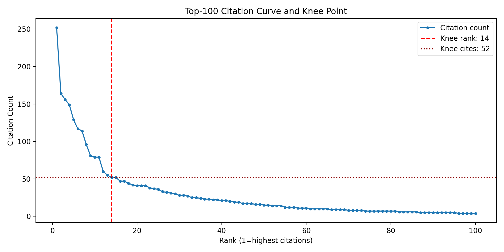
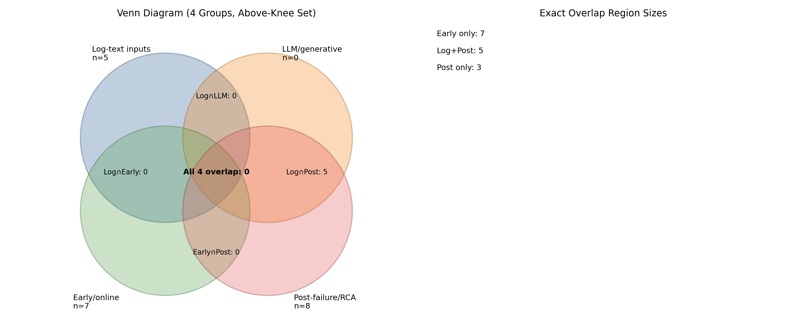

# Early CI Failure Detection: A Citation-Guided Gap Analysis with Reproducible Baselines  

## Abstract

Continuous Integration and Continuous Delivery (CI/CD) pipelines generate rich operational signals, but many practical workflows still emphasize post-failure diagnosis after compute and developer effort are already consumed. This paper maps high-impact literature relevant to CI failure analysis using a citation-guided review process, then identifies an underexplored region for a semester project. We retrieved 375 papers (2015+), ranked by citations, selected the top 100, and applied a knee heuristic to prioritize detailed reading. The resulting above-knee set contains 15 papers (knee rank 14, threshold 52 citations). A structured overlap analysis across four dimensions (log-text input, LLM/generative methods, early/online detection, and post-failure/RCA) shows an imbalance favoring post-hoc diagnosis and no LLM-centered papers in the above-knee set. To satisfy the "stand on the shoulders of giants" requirement, we executed four baseline reproductions (FastPC baseline from rca_baselines, PyRCA, iDFlakies, and DL-CIBuild) and archived runnable evidence. These results motivate a concrete next step: early-warning CI failure detection from partial and low-cost signals, evaluated against lead-time, runtime cost, and predictive quality.

## 1 Introduction

Modern software engineering workflows expose teams to many interacting choices: artifact selection, model family, objective definition, and configuration parameters. In CI/CD, these choices affect whether failures are detected early, how expensive that detection is, and how quickly teams can respond. While configurability is valuable, scaling manual tuning across fast-moving pipelines is difficult and error-prone.

For CI failure handling, delayed insight is costly. Post-failure diagnosis can be accurate, but it often arrives after resource waste and developer interruption have already occurred. This project therefore focuses on whether the literature overemphasizes post-hoc explanation relative to earlier intervention signals. In this context, configurability without systematic analytic support becomes a liability.

Accordingly, this submission combines a structured literature mapping exercise with reproducible baseline implementations. The immediate objective is not to claim a new model yet, but to establish a defensible problem framing, identify a concrete gap, and validate that strong baseline artifacts are runnable for downstream comparison.

### Research Questions

1. How are AI methods currently applied to CI/CD failure-related tasks (prediction, diagnosis, prioritization, optimization)?
2. Within high-impact literature, how much emphasis is placed on post-failure explanation versus early/online detection?
3. Can a practical semester project be anchored on reproducible baselines while targeting earlier and lower-cost CI failure detection?

### Contributions

- A reproducible literature pipeline from search to knee-selected reading set (375 merged papers, top 100 ranked, 15 above-knee).
- A structured overlap analysis of above-knee work that isolates an underexplored center-gap relevant to early CI detection.
- End-to-end baseline reproduction evidence across four tools/papers: FastPC baseline (rca_baselines), PyRCA, iDFlakies, and DL-CIBuild.
- A concrete post-6.0 experiment direction with measurable criteria (lead-time, runtime cost, precision/recall tradeoff).

### Roadmap

Section 2 describes the literature mapping process and states the gap in Section 2.3. Section 3 reports baseline reproduction outcomes. Section 4 concludes with implications and next steps.

## 2 Literature Mapping and Gap Analysis

### 2.1 Search Setup and Corpus Construction

We performed a structured query-based retrieval using Google Scholar. The intent was to cover CI failure analysis and adjacent tasks in software engineering since 2015.

Queries:

- continuous integration build failure
- travis ci build failure
- continuous integration flaky tests
- ci/cd log analysis software
- continuous integration regression test selection

Constraints:

- Venue Focus: top software engineering venues
- Year filter: 2015+
- Manual screening: retained papers relevant to CI/CD failure analysis in software engineering

Outcome:

- Merged corpus size: 375 papers
- Citation-ranked shortlist: top 100 papers

The above-knee set is concentrated in mainstream software engineering venues such as ICSE/ICSE-SEIP, ASE, EMSE, MSR, ICSME, IST, JSS, and ICST, which is consistent with the course instruction to focus mostly on top SE venues.

### 2.2 Citation Ranking and Knee-Based Prioritization

To keep the review focused while preserving influence coverage, we ranked results by citation count and used a knee heuristic on the top-100 citation curve. The knee is computed as the point with maximum distance from the line connecting the first and last ranked points.

Computed values:

- Top list size: 100
- Knee rank: 14
- Knee threshold: 52 citations
- Above-knee reading set: 15 papers

Figure 1 shows the top-100 citation curve with knee at rank 14 (threshold 52), which determines the 15-paper above-knee reading set.

### 2.3 A Gap in the Literature

Following knee-based prioritization, each above-knee paper was coded in a structured matrix with columns for input artifact, model family, task, prediction timing, and evaluation metric.

Grouping dimensions used to evaluate overlap:

- Log-text inputs
- LLM/generative methods
- Early/online detection
- Post-failure diagnosis or RCA

Observed counts in above-knee set (n=15):

- Log-text group: 5
- LLM/generative group: 0
- Early/online group: 7
- Post-failure/RCA group: 8

Figure 2 visualizes the overlap pattern used to identify the central unexplored region.
The exact overlap structure is sparse: 7 papers fall in the early/online-only region, 5 fall in the overlap between log-text inputs and post-failure/RCA, and 3 fall in the post-failure/RCA-only region; all other pairwise, triple, and four-way overlaps are zero.

Interpretation:

- The most-cited core cluster remains slightly weighted toward post-hoc diagnosis and test optimization.
- Early/online signals exist but are not dominant at the center of influence.
- No LLM-centered methods appear in this above-knee set.

Center-gap statement:

The underexplored region for this project is early CI failure detection from partial, inexpensive pipeline signals, where lead-time and runtime cost are treated as first-class objectives alongside predictive quality.

Contrast with prevalent prior patterns:

- Timing bias: many systems emphasize post-failure localization over pre-failure warning.
- Objective bias: many evaluations emphasize final prediction quality but do not foreground intervention lead-time.
- Practicality gap: reproducibility and operational constraints are inconsistent across tools and papers.

## 3 Baseline Reproduction Evidence

To ground this work in executable prior art, we ran and archived four baseline candidates.

| Baseline | Primary Goal | Execution Mode | Outcome | Key Result |
|---|---|---|---|---|
| KnowledgeDiscovery/rca_baselines (FastPC) | Root-cause ranking from metrics | Docker | Pass | Per-metric rankings generated for six metrics; example top scores: CPU 0.8679, memory 0.8676 |
| salesforce/PyRCA | Root-cause analysis framework | Docker | Pass | Top ranked causes: ROOT_conn_pool 0.99, ROOT_request 0.6462, ROOT_pod 0.5325 |
| UT-SE-Research/iDFlakies | Order-dependent flaky test detection | Local + Maven | Pass | 1 order-dependent flaky test detected in demo run |
| stilab-ets/DL-CIBuild (rank 12 paper) | CI build-failure prediction | Docker | Pass | Test AUC 0.8843, Accuracy 0.8885, F1 0.8694 |

Selected quantitative outputs:

- DL-CIBuild test metrics: AUC 0.8843, Accuracy 0.8885, F1 0.8694.
- iDFlakies local demo: one detected order-dependent flaky test (demo.ODFlakeTest.polluted).
- FastPC generated rankings across six metrics with top scores in the 0.865-0.868 range.
- PyRCA ranked candidate root causes with top score 0.99.

These reproductions satisfy the baseline requirement for the milestone and provide concrete comparators for the next-phase early-warning prototype.

## 4 Conclusion and Next Steps

This milestone establishes three foundations: (1) a citation-guided map of influential literature, (2) an evidence-backed gap centered on early CI failure warning, and (3) reproducible baseline implementations across multiple methodological families.

The post-6.0 direction is to design an early-warning CI detector that predicts likely failure before full pipeline completion and compare it against reproduced baselines using:

- Detection lead-time,
- Runtime/compute cost,
- Precision/recall (or equivalent task-aligned quality metrics).

## References

[1] iDFlakies: A Framework for Detecting and Partially Classifying Flaky Tests. 2019 IEEE 12th International Conference on Software Testing, Verification and Validation (ICST), 2019. DOI: 10.1109/ICST.2019.00038.

[2] Improving the prediction of continuous integration build failures using deep learning. Automated Software Engineering, 2022. DOI: 10.1007/s10515-021-00319-5.

[3] KnowledgeDiscovery. rca_baselines (FastPC baseline implementation). Software repository: https://github.com/KnowledgeDiscovery/rca_baselines (accessed 2026-03-26).

[4] Salesforce. PyRCA. Software repository: https://github.com/salesforce/PyRCA (accessed 2026-03-26).

[5] Senthilkumar, L., and Menzies, T. LLMs for Optimization. Reference paper used for Section 1 and Section 2.3 structural guidance.
